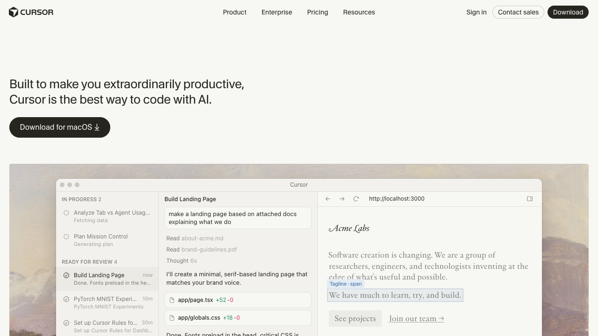
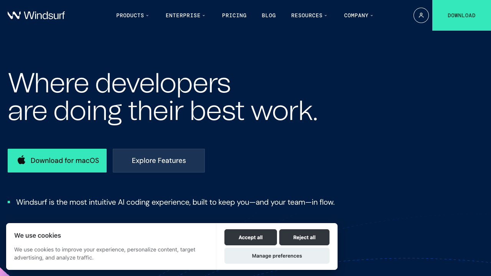
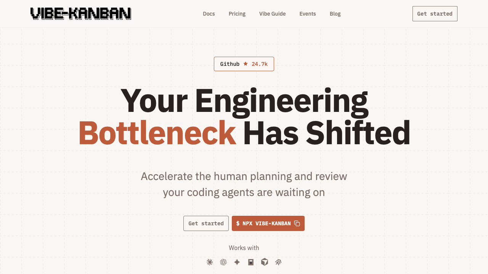
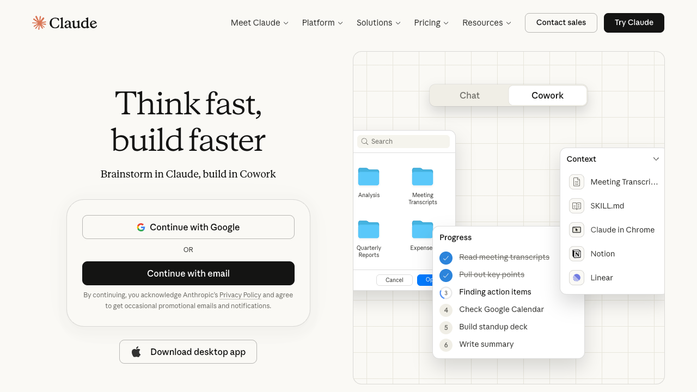
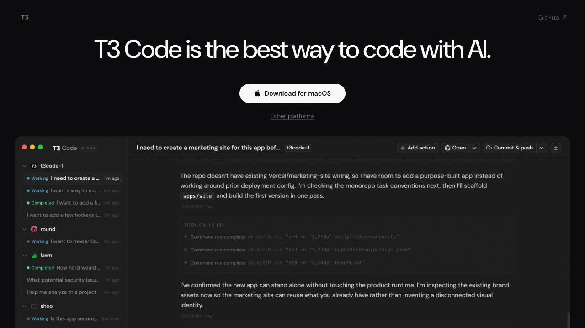
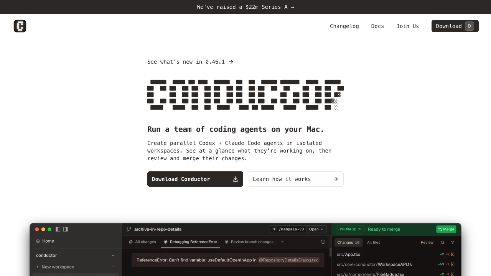
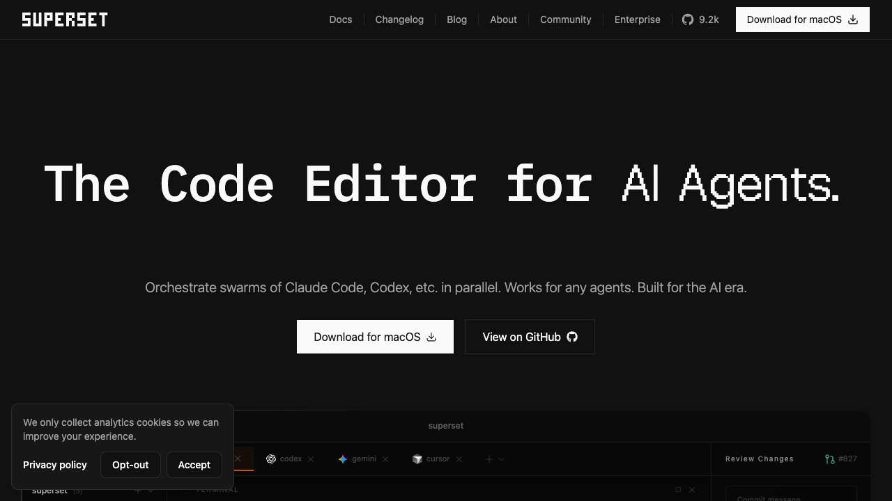
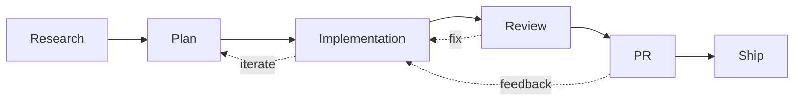
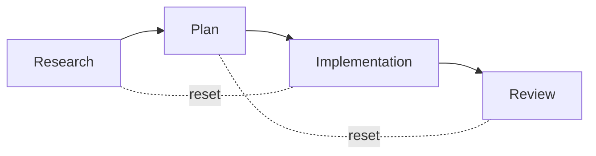

  
Slidev talk

  <h1 class="!text-5xl !leading-tight !font-700 text-white max-w-4xl mx-auto">
    The future of IDE's in the agent of agents
  </h1>
  

    My AI first coding workflow: the tools, prompts and flows I use automate the simple parts of engineering work.
  

  

    Agent orchestration
    Parallel threads of work
    Context engineering
  

<!--
Hey from comment
-->

---
layout: center
class: text-left
---

<h1 class="!text-slate-100">Quick room check</h1>

  

    How many people have multiple versions of the repo they are working in?
  

  

    How many people use worktrees specifically?
  

  

    How many agents do you run in parallel on average?
  

---
layout: default
layoutClass: gap-14
---

<h1 class="!text-slate-100">Who am I?</h1>

- Wrote my first line of code at 10 or 11 trying to build a Unity game
- Founder of many failed or sunset startups and side projects
- Before Eleven, I worked as an SDE on software for operating spacecraft
- I do a lot of open source work; biggest claim to fame is `Zog`, a validation library for Go
- I work mostly on the marketing website

---
layout: image-right
image: /assets/loot.jpeg
class: bg-top
layoutClass: gap-14
---

<h1 class="!text-slate-100">And also!</h1>

- I run my own home server
- I play Dungeons and Dragons and airsoft
- I hate breaking flow, so I hate notifications

---
layout: default
---

## What I won't discuss today

- Tools or SOPs for improving agent output
- Context engineering
- Claude Code Specific ideas
- Which models are best for what
- Skills, MCPs, subagents...

But if people are interested in some of that maybe I can come back at some point to chat about it

---
layout: statement
class: text-center
---

## Guilty admision

I was a coding agent skeptic until ~Dec 2025

<!--
I was using cursor every day, in fact I started in 2023 few months after they launched. 

- But to speed up the work I was doing at the time. very hands on
-->

---
layout: default
class: "!flex !flex-col !overflow-hidden"
---

<h1 class="!text-slate-100 !flex-shrink-0">But then something changed. New opus & GPT models</h1>

So I started using cursor's background agents. With and without worktrees

<ImageContainer src="/assets/cursor-2.png" alt="Cursor agent interface" />

<!--

- editing, conflicts bringing agent code into current working branch to make edits
- Forgetting where I had threads open. What stuff is shipped, waiting for reviews, etc. Couldn't keep it all in my head. 
- Losing context of what I was doing inside a thread. What file was I looking at? What file was I editing? etc
-->

---
layout: image
class: text-left
image: /assets/isolation.png
backgroundSize: contain
---

<h1 class="!text-slate-100">I had this problem every week</h1>

---
layout: center
---

<h1 class="!text-slate-100">4 Cursor instances</h1>

I found myself with 4 cusor instances open juggling between them.

<ImageContainer src="/assets/4-cursors.png" alt="Cursor agent interface" />

<!--
- I would often forget in what instance I had what. Would jump around
- PC crashed every day
- Often times I needed a new instance which meant opening a new worktree or project which took like 10s and completely killed my flow
- Ultimately I needed more than 4
-->

---
layout: center
---

<h1 class="!text-slate-100 !text-6xl text-center">Cloud agents</h1>

---
layout: image
image: /assets/cloud-agents/1st.png
backgroundSize: contain
---

---
layout: image
image: /assets/cloud-agents/2nd.png
backgroundSize: contain
---

---
layout: statement
---

## What am I doing wrong?
Someone has to have figured this out already. Lets research

---
layout: section
---

## Current solution shapes

---
zoom: 0.82
---

<h1 class="!text-slate-100">IDE's</h1>

  

    
    

      
Cursor

    

  

  

    
    

      
Windsurf

    

  

---
zoom: 0.82
---

<h1 class="!text-slate-100">Canvan</h1>

  

    
    

      
Vibe Kanban

    

  

  

    
    

      
Automaker

    

  

---
zoom: 0.76
---

<h1 class="!text-slate-100">Cloud agents</h1>

  

    
    

      
Claude

    

  

  

    
    

      
Cursor

    

  

  

    
    

      
Devin

    

  

---
zoom: 0.76
---

<h1 class="!text-slate-100">Agent first</h1>

  

    
    

      
T3 Code

    

  

  

    
    

      
Cursor 3.0

    

  

  

    
    

      
Conductor

    

  

  

    
    

      
Superset

    

  

---
zoom: 0.82
layout: image
image: https://miro.medium.com/v2/resize:fit:700/1*ReBwrC1sc9USnhvYXcrd4A.jpeg
---

<!-- <h1 class="!text-slate-100">Gastown</h1> -->

<!--
Gastown. Oschestrator first
-->

---
layout: center
---

<h1 class="!text-slate-100 !text-6xl text-center">Build your own</h1>

---
layout: center
zoom: 0.82
---

<h1 class="!text-slate-100">Thinking in threads</h1>

<!--
Now we just have to run this in parallel as much as possible. That means doing as little ourselves as possible and delegating as much as possible to the agent
-->

---
layout: image
image: /assets/threads-of-work.png
---

<!--
Key idea here which is pretty obvious is that the less user involvement the more threads we can have at once
-->

---
layout: default
layoutClass: gap-10
---

<h1 class="!text-slate-100">Creator of OpenClaw</h1>

<Tweet id="2019903946056237516" scale="0.85" />

<!--
- Is vibe coding
- We cannot go that far yet without disaterous consequences
-->

---
layout: statement
---

## Switched to Neovim ~btw

One persistent session per thread of work

<!--
- Wanted one persistent session per thread of work
- Each thread gets its own neovim session that stays alive
- No more juggling multiple IDE windows or forgetting where things are
-->

---
layout: default
---

<h1 class="!text-slate-100">How I work</h1>

  
1. Throw / kick off

  
2. Work

  
3. Go to what needs me

  
4. Push PRs

  
5. PR merge = session deleted

Effectively I'm a pull-based system on what needs me

<!--
- "Throw/kick off" creates a worktree, names the branch, sets up the environment automatically. Show how cursor does it. Worktree reuse is key here — don't create new ones unnecessarily
- "Work" is the agent doing its thing inside the session
- "Go to what needs me" — I poll across sessions, only jumping in where I'm actually needed
- PR merge triggers cleanup — the session and worktree get deleted automatically
- The mental model shift: I'm not pushing work forward, I'm pulling from a queue of things that need my attention
-->

---
layout: default
---

<h1 class="!text-slate-100">Why this works</h1>

  
No need to keep context of what I'm working on

  
Switching threads is instant

  
Everything is isolated — environment auto-setup

  
Hydration!

<!--
- I only have to think about the next thing and poll from the queue. No juggling mental context across threads
- Moving from one thread of work to the next is instant — just switch to the session
- Each worktree is fully isolated. Environment is automatically set up at creation time
- Hydration: when I jump into a session, the agent has already done work and left me context. I hydrate into the thread quickly rather than rebuilding context from scratch
-->

---
layout: section
---

## Into the future
What I'm working on, what I would like & where I think things are going

---
layout: default
zoom: 0.88
---

<h1 class="!text-slate-100">Levels of autonomy</h1>

  

    L0 No autonomy — each step interrupts you
  

  

    L1 Implementation — research, plan, implement, commit
  

  

    L2 PR — previous + open PR
  

  

    L3 Semi-full — previous + address feedback
  

  

    L4 Vibe — previous + merge
  

<!--
- At creation time for the thread you define its level of autonomy, which defines your interception points
- L0: no autonomy, you're involved at every step — basically pair programming
- L1: agent does research, planning, implementation, and commits — you review after
- L2: agent also opens the PR for you
- L3: agent also addresses PR feedback from reviewers autonomously
- L4: full vibe mode — agent merges when approved. You trust the process end to end
-->

---
layout: default
---

<h1 class="!text-slate-100"> <s>Cloud agents</s> Cloud sessions</h1>
Local like IDE experience

  
Sessions run remotely, not on your machine

  

    Challenge: Secrets management
  

  

    Provider model: fly.io design
  

<!--
- Cloud sessions let you offload entirely — sessions don't consume local resources
- Biggest challenge is secrets. How do you give a cloud agent access to your credentials, API keys, etc. securely?
- Provider model reference: https://fly.io/blog/design-and-implementation/ — good design for how to think about remote execution environments
-->

---
layout: default
---

<h1 class="!text-slate-100">Reset to step</h1>

Go back to a previous step and iterate from there

<!--
- Implementation is bad? Go back to plan, see what the issue is, iterate from there
- Plan is bad? Go back to research
- This is like git reset but for the agent workflow itself — you rewind the thread to an earlier stage
- Avoids starting from scratch when only one phase went wrong
-->

---
layout: statement
---

<h1 class="!text-slate-100">Port isolation</h1>

---
layout: statement
---

## Bottom line

The future is probably agent-first apps

But I don't want to wait 8s for Cursor to open, so I'm stuck in crazy land

<!--
- Agent-first apps like T3 Code, Conductor, etc. are likely the direction everything is heading
- But the overhead of GUI-heavy tools kills flow — 8 seconds to open Cursor is 8 seconds too many
- So for now, neovim + worktrees + custom orchestration is the sweet spot for me
- "Crazy land" = building your own workflow tooling, but it works
-->

---
layout: statement
---

## But at least I can say I use nvim btw

---
layout: center
class: text-center
---

<h1 class="!text-5xl !text-slate-100">Questions?</h1>

