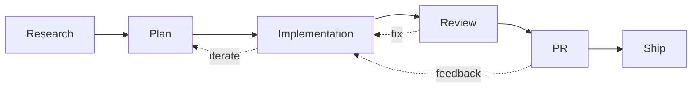

  
Slidev talk

  <h1 class="!text-5xl !leading-tight !font-700 text-white max-w-4xl mx-auto">
    The future of IDE's in the agent of agents
  </h1>
  

    My AI first coding workflow: the tools, prompts and flows I use automate the simple parts of engineering work.
  

  

    Agent orchestration
    Parallel threads of work
    Context engineering
  

<!--
Hey from comment
-->

---
layout: center
class: text-left
---

<h1 class="!text-slate-100">Quick room check</h1>

  

    How many people have multiple versions of the repo they are working in?
  

  

    How many people use worktrees specifically?
  

  

    How many agents do you run in parallel on average?
  

---
layout: statement
---

<h1 class="!text-slate-100">Obligatory mention</h1>

This is my experience and my opinions.

I am probably wrong about a bunch of stuff.

My setup and opinions are evolving, so this might be slightly different next week.

---
layout: default
layoutClass: gap-14
---

<h1 class="!text-slate-100">Who am I?</h1>

- Wrote my first line of code at 10 or 11 trying to build a Unity game
- Founder of many failed or sunset startups and side projects
- Before Eleven, I worked as an SDE on software for operating spacecraft
- I do a lot of open source work; biggest claim to fame is `Zog`, a validation library for Go
- I work mostly on the marketing website

---
layout: image-right
image: /assets/loot.jpeg
class: bg-top
layoutClass: gap-14
---

<h1 class="!text-slate-100">And also!</h1>

- I run my own home server
- I play Dungeons and Dragons and airsoft
- I hate breaking flow, so I hate notifications

---
layout: statement
class: text-center
---

<h1 class="!text-slate-100">The goal</h1>

Increase your parallelism
 
without decreasing code quality

---
layout: default
---

## What you should leave with

- Ideas, tools and strategies to try for yourself to increase your own parallelism
- a better mental model for multi-threaded engineering
- A view into my setup

## What I won't discuss today

- Tools or SOPs for improving agent output
- Context engineering
- Claude Code Specific ideas
- Which models are best for what
- Skills, MCPs, subagents...

But if people are interested in some of that maybe I can come back at some point to chat about it

---
layout: statement
class: text-center
---

## Guilty admision

I was a coding agent skeptic until Dec 2025

---
layout: center
zoom: 0.82
---

<h1 class="!text-slate-100">Thinking in threads</h1>

<!--
Now we just have to run this in parallel as much as possible. That means doing as little ourselves as possible and delegating as much as possible to the agent
-->

---
layout: image
image: /assets/threads-of-work.png
---

<!--
Key idea here which is pretty obvious is that the less user involvement the more threads we can have at once
-->

---
layout: default
layoutClass: gap-10
---

<h1 class="!text-slate-100">Creator of OpenClaw</h1>

<Tweet id="2019903946056237516" scale="0.85" />

<!--
- Is vibe coding
- We cannot go that far yet without disaterous consequences
-->

---
layout: section
---

# Current solution shapes

---
zoom: 0.82
---

<h1 class="!text-slate-100">IDE's</h1>

  

    
    

      
Cursor

    

  

  

    
    

      
Windsurf

    

  

---
zoom: 0.82
---

<h1 class="!text-slate-100">Canvan</h1>

  

    
    

      
Vibe Kanban

    

  

  

    
    

      
Automaker

    

  

---
zoom: 0.76
---

<h1 class="!text-slate-100">Cloud agents</h1>

  

    
    

      
Claude

    

  

  

    
    

      
Cursor

    

  

  

    
    

      
Devin

    

  

---
zoom: 0.76
---

<h1 class="!text-slate-100">Agent first</h1>

  

    
    

      
T3 Code

    

  

  

    
    

      
Cursor 3.0

    

  

  

    
    

      
Conductor

    

  

  

    
    

      
Superset

    

  

---
zoom: 0.82
layout: image
image: https://miro.medium.com/v2/resize:fit:700/1*ReBwrC1sc9USnhvYXcrd4A.jpeg
---

<!-- <h1 class="!text-slate-100">Gastown</h1> -->

<!--
Gastown. Oschestrator first
-->

---
layout: center
---

<h1 class="!text-slate-100 !text-6xl text-center">Build your own</h1>

---
layout: center
---

<h1 class="!text-slate-100">Late last year I moved to 4 Cursor worktrees and instances</h1>

  

    Hard to know what I was working on
  

  

    Hard to know what needed my attention
  

  

    High context switching cost
  

  

    Easy to conflict with my own edits in the same repo
  

The problem was not lack of agent power. The problem was lack of thread management.

---
layout: image
class: text-left
image: /assets/isolation.png
backgroundSize: contain
---

<h1 class="!text-slate-100">Shared repos are hostile to parallel agent work</h1>

---
layout: center
---

<h1 class="!text-slate-100">Then I tried cloud agents more seriously</h1>

They felt like the right abstraction for parallelism.
  
In practice, they were the wrong abstraction for engineering.

---
layout: center
class: text-left
---

<h1 class="!text-slate-100">Why cloud agents break down in practice</h1>

<v-clicks>

- low steerability once they are off doing their thing
- weak feedback loops for browser, tests and partial review
- too much latency for tight iteration
- the work comes back as a PR-shaped blob instead of a living thread
- less obvious recovery path when the agent goes weird

</v-clicks>

  
Screenshot placeholder

  

    Add the image of trying to get a cloud agent to change one line of code.
  

---
layout: two-cols
layoutClass: gap-14
---

<h1 class="!text-slate-100">When I decided to go all in</h1>

## Switch to `nvim`

- many IDEs open at the same time
- keyboard-first switching
- low friction between threads

## Add `tmux`

- cheap session management
- terminal native multiplexing
- fast jumps between active threads

::right::

## Add `cc`

- local agent in the same environment as the code
- direct access to tests, browser and repo state
- way more steerable than remote async flows

Show `tmux-sessionizer` here.

---
layout: two-cols-header
---

<h1 class="!text-slate-100">Then I needed an engine for threads of work</h1>

::left::

## Droner

- throw as many threads of work at it as I want at the start of the day
- jump between them at my own pace
- slowly handle each one until it merges
- local first today, backend-oriented API for later

## Why it exists

- worktrees alone are not orchestration
- sessions alone are not orchestration
- PRs alone are not orchestration

::right::

## Things it handles

- background worktree creation
- worktree reuse
- hydration
- GitHub integration
- branch name generation
- moving to the next relevant session with `alt+]`
- oversight via slash commands

---
layout: center
---

<h1 class="!text-slate-100">Thread orchestration is mostly a human factors problem</h1>

  

    
Discover

    
What needs my attention next?

  

  

    
Switch

    
How fast can I move into the thread?

  

  

    
Recover

    
How easily can I fix or redirect it?

  

---
layout: two-cols
layoutClass: gap-14
---

<h1 class="!text-slate-100">What parallelism actually requires</h1>

## What the agent needs

- enough autonomy to make progress
- a way to check its own work
- browser, tests, build and repo access
- isolated code environment

::right::

## What the human needs

- preview and test surfaces
- minimal context-switch strain
- a way to undo large bad turns
- a way to jump into the thread and help
- a backlog beyond just one ticket
- control over oversight level per thread

---
layout: center
zoom: 0.9
---

<h1 class="!text-slate-100">Oversight should be adjustable</h1>

  

    
Low oversight

    
Just get me a PR

  

  

    
Medium

    
Review implementation

  

  

    
Higher

    
Review plan first

  

  

    
Highest

    
Keep asking me before risky moves

  

Different threads deserve different supervision. A typo fix and a risky refactor should not have the same control surface.

---
layout: two-cols-header
---

<h1 class="!text-slate-100">Why I think cloud agents are the wrong default abstraction</h1>

::left::

## Good at

- queueing work
- fire-and-forget demos
- long running isolated tasks

::right::

## Bad at

- continuous steering
- rich local verification
- preserving flow
- feeling like part of your IDE instead of a separate product

---
layout: center
---

<h1 class="!text-slate-100">Looking forward</h1>

The future is a meta-IDE:
 
many sub-IDEs, local and remote, each running their own agent,
 
with the line between local and remote disappearing.

Not one chat box. Not one tab. A fabric of active engineering threads.

---
layout: section
---

<h1 class="!text-slate-100">If there is time</h1>

Context engineering and agent flows

---
layout: two-cols
layoutClass: gap-14
---

<h1 class="!text-slate-100">Context engineering matters</h1>

## Better results come from better context

- isolate work so context stays legible
- keep docs and subsystem notes current
- make verification cheap
- make rollback and redirection cheap

::right::

## Agent flow matters too

- research
- plan
- implement
- verify
- review
- merge

Same stages as before. Better tools for moving between them.

---
layout: center
class: text-center
---

<h1 class="!text-slate-100">Takeaways</h1>

  
Parallelism without orchestration mostly creates confusion.

  
Local agents win when you care about steering, feedback loops and flow.

  
The real product is not the model. It is the thread management layer around the model.

  
The future IDE probably looks like orchestration plus context engineering.

---
layout: center
class: text-center
---

<h1 class="!text-slate-100">Questions?</h1>

I would genuinely love to hear what you think I am wrong about.

